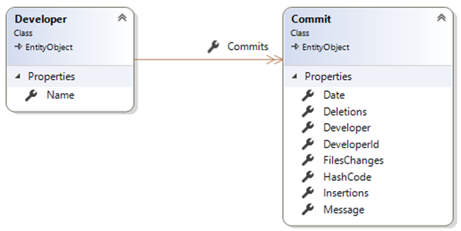
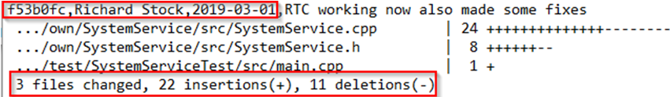
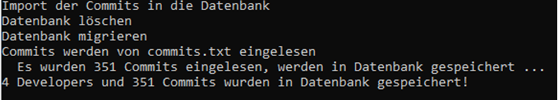
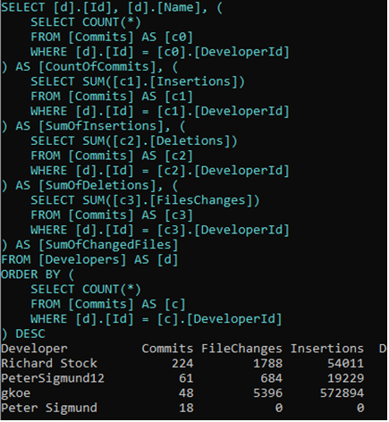
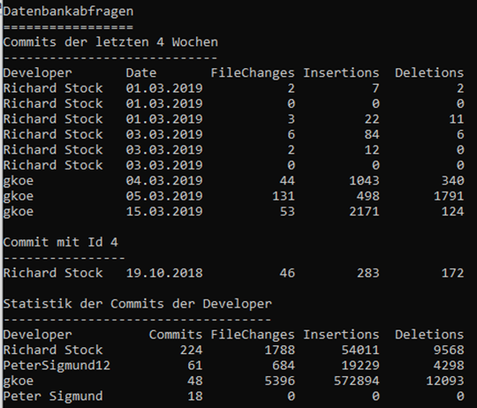

# GitStatistics

## Lehrziele

* Entity Framework Core mit UOW-DB-Zugriff

Es ist eine einfache Anwendung zu implementieren, die Statistikdaten einer Diplomarbeit (GIT-Log) in eine Datenbank einliest und auswertet. 

## Core

Die Klasse `Developer` verwaltet den Namen und die `Commit` für den jeweiligen Entwickler. Die `Commits` geben über die zu analysierenden Werte zu bestimmten Zeitpunkten Auskunft. Die Entities sind, bis auf etwaige Annotationen bereits angelegt.

Im `Corelayer` sind die Contracts für die Repositories bedarfsgerecht anzulegen.

## Core.ImportController

Die Logdaten aus dem Versionsverwaltungssystem Git steht in Form der Textdatei `commits.txt` zur Verfügung. Die benötigten Informationen sind selbst zu parsen.

Sollte die kleine algorithmische Übung nicht umsetzbar sein, stehen die Daten auch als csv-Datei (`commits.csv`) bereit.

## Persistence

Die Migration ist bereits im Projekt enthalten und muss nur durchgeführt werden, wenn Änderungen am Datenmodell vorgenommen werden.

Die Repositories müssen noch um die benötigten Methoden erweitert werden.

## Datenbankabfragen

Implementieren Sie drei Abfragen auf die Datenbank. Siehe dazu die `TODO`-Markierungen im Code. 

Beachten Sie dabei, dass möglichst wenige Daten aus der Datenbank geladen werden. Legen Sie, falls notwendig DTOs an, um die zu ladenden Daten zu modellieren.

Kontrollieren Sie die entstehenden Queries mit Hilfe eines Loggers.

*Hinweis*: Die Screenshots beziehen sich auf die Commits aus der Datei `commits.csv`. Die Commits in der Datei `commits.txt` weichen geringfügig ab.